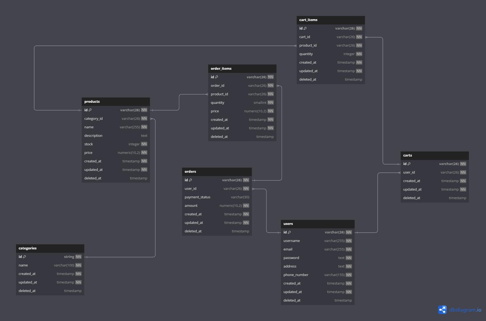

# Backend Challange Mooi Studio

This is repository Backend Challange at Mooi Studio for Technical Test

## Features

### 1. Product Management

- **View Product List:** Customers can view the list of products and categorized by their respective categories.
- **Add Product to Shopping Cart:** Customers can add products to their shopping cart.
- **Delete Product from Shopping Cart:** Customers can remove products from their shopping cart.
- **View Shopping Cart:** Customers can see a list of products that have been added to the shopping cart.

### 2. Order Management

- **Checkout and Make Payment:** Customers can checkout and initiate payment transactions. (Note: Payment gateway integration is not implemented; this feature only creates orders.)

### 3. User Management

- **Login:** Customers can login.

## Stack

- [Docker Enginer](https://docs.docker.com/engine/) v26.1.0
- [Docker Compose](https://docs.docker.com/compose/) v2.26.1
- [Go-lang](https://go.dev/) v.1.20
- [Gorilla mux](https://github.com/gorilla/mux) - A powerful URL router and dispatcher for building RESTful services with Go.
- [pgxpool](https://pkg.go.dev/github.com/jackc/pgx/v5/pgxpool) A package pgxpool is a concurrency-safe connection pool for pgx.
- [viper](https://github.com/spf13/viper) Viper is a complete configuration solution for Go applications including 12-Factor apps. It is designed to work within an application, and can handle all types of configuration needs and formats. It supports:
- [Universally Unique Lexicographically Sortable Identifier](https://github.com/oklog/ulid)

## Getting Started

To get started with the project, follow these steps:

1. Clone the repository:

```bash
git clone https://github.com/ZyoGo/Backend-Challenge.git
```

2. Run with docker compose:

```bash
docker compose up -d
```

> im using docker compose for easily setup development

3. Run migrations database:

```bash
cd Backend-Challenge
make migrate-up
```

> im using makefile for run migrations

4. We can check if the service is running using docker logs:

```bash
docker logs -f --tail 50 backend-challenge-server-1
```

5. Or we also can hit the API Health

```bash
curl --location 'localhost:4001/health'
```

## Design Database (ERD)


